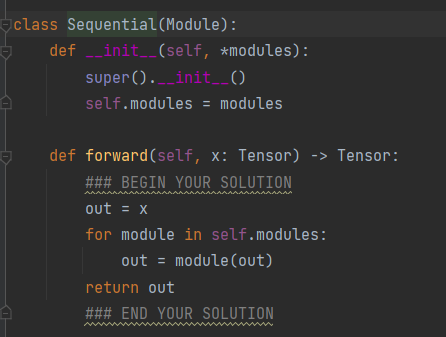
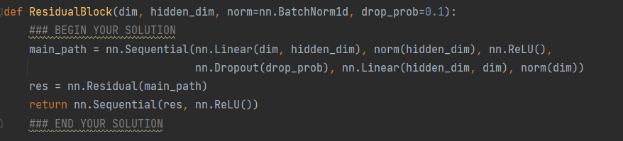
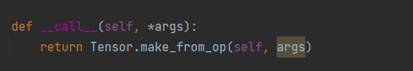

从mlp_resnet应用出发，主要观察`nn.Sequential`

从`forward`可以看见sequtial就是以此执行输入module，这些输入就是linear那些层

然后我们观察linear这些module层是如何实现的

首先在前向传播的时候就是通过`forward`方法，在所有的子模块中，输入与输出都是`tensor`类型，这个`tensor`类型是我们之前实现的，所以在所实现的子模块的`forward`方法中，只需要根据模块的作业调用对应的`tensor.op`即可，由于在`tensor`类中，我们重载了操作符，所以有的地方也可以直接使用`+ - * /`等来实现

在反向传播时：首先我们有loss_fun得到loss，loss_fun也属于子模块，我们上面提到了子模块的输入输出都是`tensor`类型，所以loss就是`tensor`类型，然后我们根据`tensor.backward`来实现参数更新算法，在这个算法中主要是通过深度拓扑来实现，算法在这里不在介绍，主要讲解一些细节，在构建计算图的时候是如何设置`inputs`的，因为我们整个获取拓扑排序是把inputs视作两个节点的边，然后查找的。观察`value`类的代码可以发现，是根据`make_from_op`对`value`对象设置inputs的，但是我们后续并没有显示是调用这个函数，而是通过`__call__`函数，在各个算子进行计算的时候就自动的调用了`__call__`然后设置inputs

